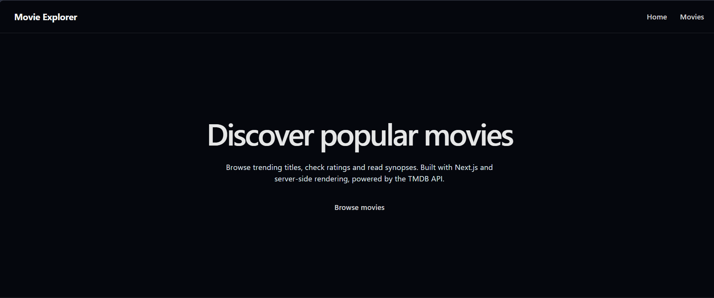
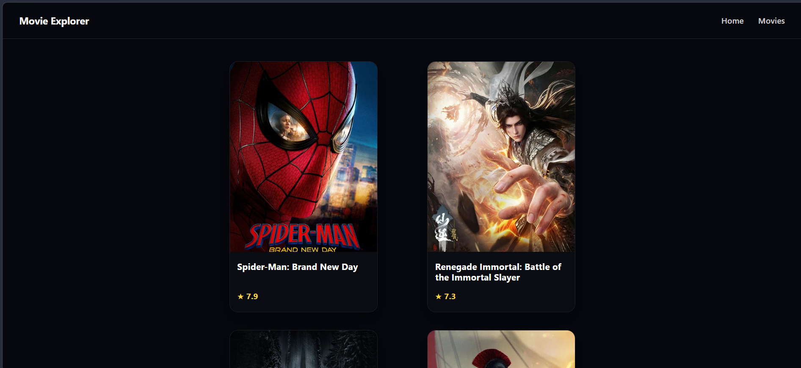
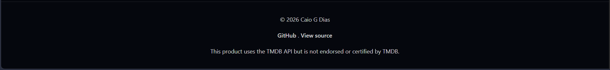

# Movies SSR

A movie browser built with Next.js and server-side rendering, powered by [The Movie Database (TMDB)](https://www.themoviedb.org/) API. It is the server-rendered counterpart of my [Movies SPA](https://github.com/caiogd20/Movies-spa) project.

**Live demo:** https://movies-ssr-one.vercel.app

## Screenshots

### Home page



### Movies page



### Footer



## Features

- Popular movies grid with poster, title and rating
- Movie details page with synopsis, rendered on the server
- The TMDB token is only used on the server and never reaches the browser

## Tech stack

- **Next.js** (App Router) + **React**
- **Axios** for HTTP requests
- **React Query** for data fetching and caching
- Deployed on **Vercel**

## Getting started

```bash
git clone https://github.com/caiogd20/movies-ssr.git
cd movies-ssr
npm install
cp .env.example .env   # then set TMDB_API_READ_ACCESS_TOKEN
npm run dev
```

Open http://localhost:3000. You can get a free API read access token at [themoviedb.org](https://www.themoviedb.org/settings/api).

## Scripts

| Command | Description |
| --- | --- |
| `npm run dev` | Start the development server |
| `npm run build` | Create a production build |
| `npm start` | Run the production build |

## Credits

This product uses the TMDB API but is not endorsed or certified by TMDB.